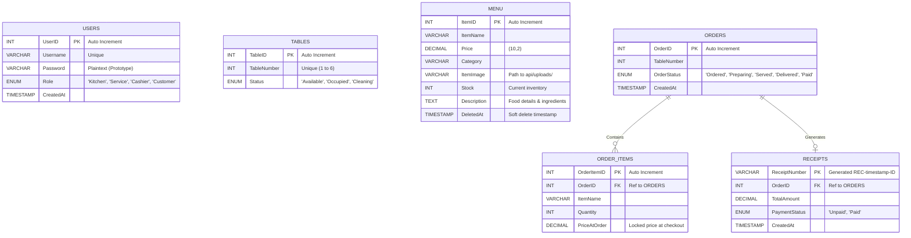

# Sikwate House QR Prototype - Web System Overview

  

## ⚠️ PROTOTYPE DISCLAIMER
This software is currently a **Web-Based Prototype** built for testing and demonstration purposes. It simulates the core functionality (ordering, kitchen management, billing, and cashier checkout) of the restaurant system. 

**The actual production Mobile App will be published later.** This prototype ensures all databases, APIs, and business logic are fully verified before native mobile development begins.
---
---
**QR CODE IMAGES ARE STORED INSIDE THE FOLDER, THIS USES "IMPORT FROM" SINCE THE APP IS STILL A PROTOYPE. ONCE FULLY BUILT, IT WILL USE THE ACTUAL CAMERA INSTEAD OF "IMPORT".**

## 🚀 Recent Updates

We've recently enhanced the prototype with several key features to improve operations and user experience:

- **📦 Menu Stock Management**: The kitchen can now track and update real-time inventory levels for every food item. Stock automatically decrements upon customer orders, with built-in protections to prevent overselling.
- **✨ Enhanced Food Details**: Customers can now click on any menu item to open a premium detail modal, featuring high-resolution images, full ingredients/descriptions, and current stock availability.
- **🗑️ Soft-Delete & Trash System**: Deleted menu items are now moved to a "Trash" repository instead of being permanently removed, allowing for quick restoration of accidentally deleted records.
- **🔔 Centered UI Notifications**: All critical staff actions (Add, Update, Restore, Delete, Serve) now use prominent centered popups (SweetAlert2) for maximum visibility on mobile devices.
- **🔐 "Login" Branding**: Standardized authentication terminology from "Authorize" to "Login" across all staff and launcher portals for better clarity.
- **⚡ Performance: API Cache-Busting**: Implemented automatic cache-busting on all dashboard data fetches to ensure staff and customers always see the most accurate, real-time information.

---

## 📖 System Overview

The **Sikwate House QR System** is a 4-role restaurant management platform designed with a strict mobile-first aesthetic. It handles the complete lifecycle of a customer's visit, from scanning a QR code to process checkout.

### Roles & Dashboards
1. **Customer**: Scans QR code, browses the menu with real-time stock indicators, views detailed food descriptions in a premium modal, adds items to cart with inline quantity selectors (enforced by stock limits), and tracks or cancels their pending orders.
2. **Kitchen Staff**: Receives order tickets in real-time, marks them as 'Ready for Delivery', and manages the entire restaurant menu. This includes tracking available **Stock**, writing detailed **Food Descriptions**, and a Trash system for soft deletions/restorations.
3. **Service Staff**: Sees orders marked ready by the kitchen and delivers them to the specific table, logging a delivery history.
4. **Cashier**: Generates detailed receipts for generated orders, verifies itemized bills, systems tracks daily/monthly revenue, and processes final payments to clear tables.

---

## 🛠️ How to Install & Run

### Prerequisites
1. **XAMPP / WAMP** Server (For MySQL and PHP hosting).
2. **Node.js** (v18 or higher recommended).

### 1. Database Setup
1. Open XAMPP and start **Apache** and **MySQL**.
2. Go to `http://localhost/phpmyadmin`.
3. Create a new database named `sikwate_house`.
4. Import the `database/schema.sql` file provided in this repository. 
   *(This creates the tables and default staff users).*

### 2. API Setup
Ensure the project folder `Sikwate_QR` is located inside your `htdocs` (XAMPP) or `www` (WAMP) folder so the PHP scripts can execute locally.

### 3. Frontend Dependencies
Open a terminal inside the `/frontend` directory and run:
```bash
npm install
```

### 4. Running the App (Desktop App Mode)
The client specifically requested the ability to run the system **without a standard web browser**. 

To launch the prototype as a standalone "Desktop Window" (no URL bar, no tabs, native feel), run the following command in the `/frontend` directory:

```bash
npm start
```

*How it works: This command starts the Vite development server in the background and uses `wait-on` to detect when it's ready. Once ready, it forces Microsoft Edge (or Chrome) to open the page in strict `--app=` mode, stripping away the browser UI.*

---

## 📊 Entity Relationship Diagram (ERD)

Below is the database structure powering the prototype:



---

## 🔒 Default Login Credentials
For testing the staff portals, use the following credentials from the Launcher:

| Role | Username | Password |
|------|----------|----------|
| Kitchen | `kitchen` | `123` |
| Service | `service` | `123` |
| Cashier | `cashier` | `123` |

*(Note: Customers do not log in. They gain access by scanning a Table QR code from the Launcher's 'Import Image' or 'Scan' feature).*
